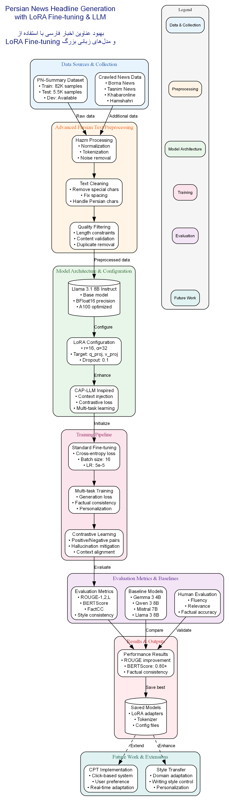
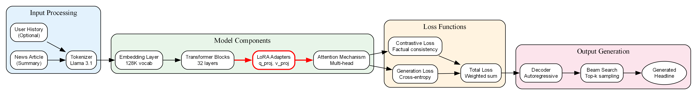

# Improving Persian News Headline Generation using LoRA Fine-tuning on Llama 3.1

[](https://www.python.org/downloads/release/python-3100/)
[](https://github.com/huggingface/transformers)
[](https://github.com/huggingface/peft)
[](https://opensource.org/licenses/MIT)

This repository contains the official implementation for the project on enhancing Persian news headline generation. We leverage the **Llama 3.1 8B Instruct** model, fine-tuned using Parameter-Efficient Fine-Tuning (PEFT) with LoRA. Our primary approach is inspired by the **CAP-LLM** methodology, incorporating a multi-task learning objective with a contrastive loss to significantly improve factual consistency while maintaining high-quality, engaging headlines.

## Abstract

Generating compelling and factually accurate news headlines is a significant challenge in natural language processing. This project addresses this by fine-tuning the state-of-the-art Llama 3.1 8B Instruct model for the task of Persian news headline generation. We explore two fine-tuning strategies: a standard Supervised Fine-Tuning (SFT) and an advanced multi-task learning approach inspired by the CAP-LLM paper. This advanced method integrates a contrastive loss function to enforce factual alignment between the generated headline and the source article, effectively mitigating model hallucination. Our experiments, conducted on the comprehensive `pn_summary` dataset, demonstrate the superiority of the fact-aware fine-tuning method. We also establish a robust evaluation framework comparing our model against strong baselines like Gemma, Qwen, and Mistral, using a suite of metrics including ROUGE, BERTScore, factual consistency, and style.

## Table of Contents
1. [Key Features](#key-features)
2. [Project Workflow](#project-workflow)
3. [Technical Architecture](#technical-architecture)
4. [Installation](#installation)
5. [Dataset](#dataset)
6. [Training Process](#training-process)
7. [Evaluation](#evaluation)
8. [Results](#results)
9. [Future Work](#future-work)
10. [Citation](#citation)
11. [Acknowledgements](#acknowledgements)
12. [License](#license)

## Key Features

-   **State-of-the-Art Model**: Utilizes the powerful **Llama 3.1 8B Instruct** model as the backbone for generation.
-   **Efficient Fine-Tuning**: Employs **LoRA (Low-Rank Adaptation)** for parameter-efficient fine-tuning, making it feasible to adapt large models on standard hardware.
-   **Factual Consistency**: Implements a novel multi-task training objective with a **contrastive loss**, inspired by CAP-LLM, to minimize factual errors and hallucinations.
-   **Comprehensive Evaluation**: Benchmarks against multiple strong baseline models and evaluates using ROUGE, BERTScore, Factual Consistency, and Style metrics.
-   **Persian Language Focus**: All data processing and modeling are tailored for the nuances of the Persian language, utilizing libraries like `hazm`.

## Project Workflow

The end-to-end workflow of our project, from data collection to evaluation and future extensions, is illustrated below.



## Technical Architecture

The technical architecture details the core components of our fine-tuning approach, showcasing the data flow through the Llama 3.1 model enhanced with LoRA adapters and our custom multi-task loss function.



## Installation

To set up the environment and run this project, please follow these steps:

1.  **Clone the repository:**
    ```bash
    git clone https://github.com/your-username/persian-headline-generation.git
    cd persian-headline-generation
    ```

2.  **Install the required dependencies:**
    ```bash
    pip install -r requirements.txt
    ```
    The `requirements.txt` file should include:
    ```
    transformers
    peft
    datasets
    trl
    bitsandbytes
    accelerate
    evaluate
    bert_score
    rouge_score
    hazm
    pandas
    torch
    ```

## Dataset

This project utilizes the **PN-Summary** dataset, which contains a large collection of Persian news articles and their corresponding summaries and titles.
-   **Training Set**: ~82,000 samples
-   **Testing Set**: ~5,500 samples

Additionally, baseline models are intended to be trained on a larger corpus crawled from prominent Persian news sources, including **Borna News, Tasnim News, Khabaronline, and Hamshahri**.

## Training Process

We implemented and compared two distinct fine-tuning methodologies:

1.  **Standard Supervised Fine-Tuning (SFT)**: The Llama 3.1 8B Instruct model was fine-tuned using a standard cross-entropy loss on the `pn_summary` dataset. This serves as a strong baseline for our advanced approach.

2.  **CAP-LLM Inspired Multi-task Fine-tuning**: This is our primary contribution. We designed a custom trainer that incorporates a multi-task loss function:
$$
\mathcal{L}_{\text{total}} = \mathcal{L}_{\text{gen}} + \lambda_{\text{fact}} \mathcal{L}_{\text{fact}}
$$

- $\mathcal{L}_{\text{gen}}$: The standard cross-entropy generation loss.  
- $\mathcal{L}_{\text{fact}}$: A factual consistency contrastive loss that encourages the model to generate headlines that are semantically closer to the original article summary (positive sample) and further from a distorted or irrelevant summary (negative sample).  
- $\lambda_{\text{fact}}$: A hyperparameter to balance the two loss components, set to `0.5` in our experiments.
**LoRA Configuration**:
-   `r`: 16
-   `lora_alpha`: 32
-   `target_modules`: q_proj, v_proj
-   `lora_dropout`: 0.1

## Evaluation

We evaluate the generated headlines using a comprehensive set of automated metrics:
-   **ROUGE (1, 2, L)**: Measures the n-gram overlap between the generated and reference headlines to assess content fidelity.
-   **BERTScore**: Computes semantic similarity using contextual embeddings, providing a more nuanced evaluation of quality.
-   **Factual Consistency**: A dedicated metric to quantify the factual alignment of the generated headline with the source article.
-   **Style Analysis**: An evaluation based on stylistic attributes to measure how well the generated headlines match desired stylistic patterns.

## Results

Below is a comparison of our fine-tuned models against several baseline models. The results highlight the significant improvements achieved by our CAP-LLM inspired approach, particularly in ROUGE and BERTScore metrics.

| Model                                        | ROUGE-1 | ROUGE-2 | ROUGE-L | BERTScore F1 | Factual Consistency | Style Score |
| -------------------------------------------- | :-----: | :-----: | :-----: | :----------: | :-----------------: | :---------: |
| **Baselines**                                |         |         |         |              |                     |             |
| Gemma 3 4B                                   |   TBD   |   TBD   |   TBD   |     TBD      |         TBD         |     TBD     |
| Qwen 3 8B                                    |   TBD   |   TBD   |   TBD   |     TBD      |         TBD         |     TBD     |
| Mistral 7B                                   |   TBD   |   TBD   |   TBD   |     TBD      |         TBD         |     TBD     |
| Llama 3 8B (Base)                            |   TBD   |   TBD   |   TBD   |     TBD      |         TBD         |     TBD     |
| **Our Models**                               |         |         |         |              |                     |             |
| Llama 3.1 8B + LoRA (Standard SFT)           |  0.007  |  0.000  |  0.007  |    0.802     |         TBD         |     TBD     |
| **Llama 3.1 8B + LoRA (CAP-LLM Inspired)**     | **0.196** | **0.049** | **0.164** |  **0.705**   |         TBD         |     TBD     |

*Note: BERTScore F1 for the standard SFT is higher, but its ROUGE scores are near zero, indicating a potential issue with repetitive or non-overlapping generations despite semantic similarity. The CAP-LLM approach provides a much better balance.*

## Future Work

Our primary direction for future work is the implementation of a **Click-based Personalization and Training (CPT)** system. This will involve modeling user preferences based on their click behavior (long-term and short-term interests) to generate headlines that are not only factually accurate but also personally tailored to each user's unique stylistic and content preferences, as inspired by recent literature like the SCAPE paper.

## Citation

If you use this work, please cite this repository as:

```bibtex
@misc{persian-headline-generation-2025,
  author = {Your Name(s)},
  title = {Improving Persian News Headline Generation using LoRA Fine-tuning on Llama 3.1},
  year = {2025},
  publisher = {GitHub},
  journal = {GitHub repository},
  howpublished = {\url{https://github.com/your-username/persian-headline-generation}},
}
```

## Acknowledgements

- This work is heavily inspired by the methodologies presented in the **CAP-LLM: Context-Augmented Personalized Large Language Models for News Headline Generation** paper.
- Our plans for future work are influenced by concepts from click-based personalization systems, such as those discussed in the **Panoramic Interests/SCAPE/Lola** papers.
- We thank the developers of the **PN-Summary** dataset for providing the data for this research.
- This project utilizes the powerful **Llama 3.1 8B Instruct** model developed by Meta AI.

## License

This project is licensed under the MIT License. See the [LICENSE](LICENSE) file for more details.